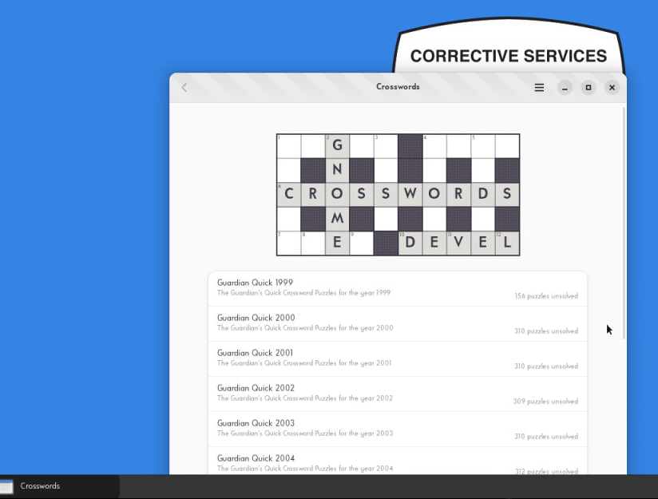

# puzzlepull

This code scrapes and converts crossword puzzles online in HTML format to a [`.ipuz`](http://www.ipuz.org/) format.
This allows the puzzles to be uploaded and solved on sites like [squares.io](http://squares.io/).

You can use the service by visiting [the associated GitHub page](https://astrojarred.github.io/puzzlepull/).

# gnome crosswords kludge

